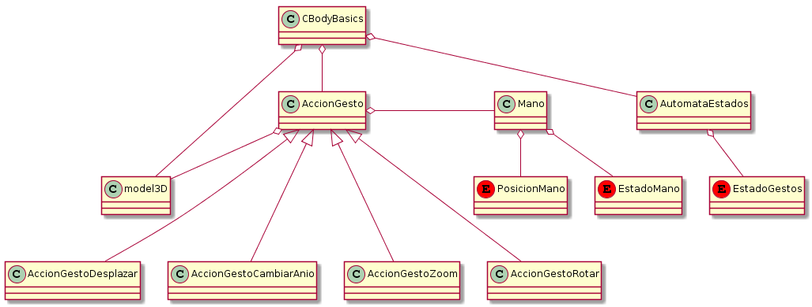

# Memoria Técnica - P2

## Diagrama de clases

Aquí se incluye el diagrama de clases muy simplificado. Información mas detallada está en la documentación.

## Documentación
La documentación se ha generado en DoxyGen para C++, se empieza seleccionado dentro de la carpeta `doc` el archivo `index.html`. Se puede consultar la jerarquía, la lista de clases, los métodos de cada clase, atributos, descripciones de lo que hacen...

## Gestos
Se han implementado 4 gestos y un estado inicial. En cada gesto se ilumina de un color diferente y además se ha puesto un tiempo de espera de 0.5s para cambiar entre gestos, así que no se debe de realizar instantáneamente. Los siguientes gestos se hacen teniendo las manos en un entorno cercano a la altura del pecho.

- Gesto inicial / posición de espera: mano derecha abierta y la izquierda cerrada. No se hace nada aquí, simplemente es un estado para no realizar nada, en espera. Se ilumina de blanco.

- Gesto desplazar: se realiza con la mano izquierda abierta y la derecha cerrada. Al mover la mano derecha se mueve el cubo en la dirección que movamos nuestra mano en el plano XY; es como si agarrásemos el objeto y lo moviésemos a nuestro antojo. Se ilumina de rojo.

- Gesto rotar: se realiza con las dos manos abiertas. Al rotar las manos como si estuvieran en una circunferencia hacemos que rote el objeto en el sentido que lo estemos haciendo; es como si tuviésemos el objeto en las manos y rotándolo de verdad en el plano XZ. Se ilumina de amarillo.

- Gesto zoom: se realiza con las dos manos cerradas. En el eje X separamos o acercamos las manos a la par más o menos y hacemos que el objeto se agrande o empequeñezca; es como si cogiésemos/agarrásemos el objeto y lo estiramos/compactamos. Se ilumina de azul.

Este gesto se realiza con la mano izquierda a la altura o más de la cabeza, ya que la línea temporal va a estar en lo alto.

- Gesto cambiar año: se realiza con la mano izquierda abierta y la derecha cerrada en lo alto. Sin más que desplazar en el eje X la mano, movemos la marca temporal (el año actual) por la línea temporal permitiéndonos de cambiar de modelo según en la franja temporal en la que estemos. Se ilumina de negro.
